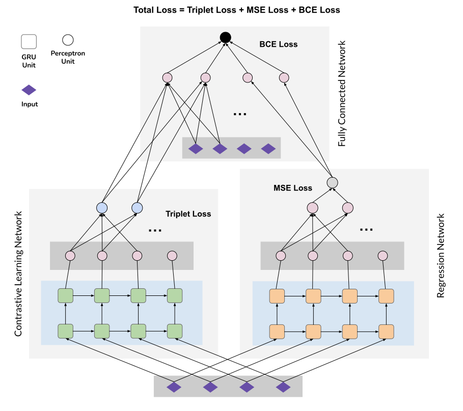

# Enhancing Multivariate Time Series-based Solar Flare Prediction with Multifaceted Preprocessing and Contrastive Learning

## Abstract
Accurate solar flare prediction is crucial due to the significant risks that intense solar flares pose to astronauts, space equipment, and satellite communication systems. Our research enhances solar flare prediction by utilizing advanced data preprocessing and classification methods on a multivariate time series-based dataset of photospheric magnetic field parameters. First, our study employs a novel preprocessing pipeline that includes missing value imputation, normalization, balanced sampling, near decision boundary sample removal, and feature selection to significantly boost prediction accuracy. Second, we integrate contrastive learning with a GRU regression model to develop a novel classifier, termed ContReg, which employs dual learning methodologies, thereby further enhancing prediction performance. To validate the effectiveness of our preprocessing pipeline, we compare and demonstrate the performance gain of each step, and to demonstrate the efficacy of the ContReg classifier, we compare its performance to that of sequence-based deep learning architectures, machine learning models, and findings from previous studies. Our results illustrate exceptional True Skill Statistic (TSS) scores, surpassing previous methods and highlighting the critical role of precise data preprocessing and classifier development in time series-based solar flare prediction.



## How to Cite

If you find our method useful in your research or work, we kindly ask that you cite our paper. The paper associated with this repository has been accepted at ICMLA 2024 and is now available on arXiv:
[https://arxiv.org/abs/2409.14016](https://arxiv.org/abs/2409.14016)

Here is the BibTeX citation for your reference:

```bash
@misc{contreg2024,
      title={Enhancing Multivariate Time Series-based Solar Flare Prediction with Multifaceted Preprocessing and Contrastive Learning}, 
      author={MohammadReza EskandariNasab and Shah Muhammad Hamdi and Soukaina Filali Boubrahimi},
      year={2024},
      eprint={2409.14016},
      archivePrefix={arXiv},
      primaryClass={astro-ph.SR},
      url={https://arxiv.org/abs/2409.14016}, 
}
```

We appreciate your citation!


## Notebooks

1. **Part1_Reading-SWANSF-Dataset.ipynb**: This notebook covers the initial steps of reading and understanding the SWAN-SF dataset, which contains comprehensive multivariate time series data of solar active regions.

2. **Part2_Preprocessing.ipynb**: This notebook details our novel preprocessing pipeline, including missing value imputation, normalization, balanced sampling, near decision boundary sample removal, and feature selection.

3. **Part3_ContrastiveRegressionClassifier.ipynb**: This notebook demonstrates the implementation of our novel deep learning-based classifier, ContReg, which combines contrastive learning with a GRU regression model for high-accuracy prediction.

4. **Part4_FinalVisualizations.ipynb**: This notebook provides visualizations to showcase the performance of our preprocessing pipeline and classifier, comparing them to previous studies and other sequence-based deep learning architectures such as LSTM, GRU, RNN, and 1D-CNN.

## Setup and Usage

### Prerequisites

- Python 3.x
- Jupyter Notebook
- Required Python libraries (listed in `requirements.txt`)

### Installation

1. Clone the repository:

```bash
git clone https://github.com/samresume/PreprocessingPipeline-ContRegClassifier-SWANSF.git
cd PreprocessingPipeline-ContRegClassifier-SWANSF
```

2. Install the required libraries:

```bash
pip install -r requirements.txt
```

### Running the Notebooks

1. **Part1_Reading-SWANSF-Dataset.ipynb**:
   - Open the notebook in Jupyter.
   - Follow the steps to read and explore the SWAN-SF dataset.

2. **Part2_Preprocessing.ipynb**:
   - Run the notebook to preprocess the data using our pipeline.

3. **Part3_ContrastiveRegressionClassifier.ipynb**:
   - Implement and train the ContReg classifier using the preprocessed data.

4. **Part4_FinalVisualizations.ipynb**:
   - Generate visualizations to compare the performance of our method with previous studies.

## Results

Our findings demonstrate exceptional True Skill Statistic (TSS) scores, exceeding previous methods and highlighting the critical role of precise data preprocessing and classifier development in time series-based solar flare prediction.

## License

This project is licensed under the MIT License.

